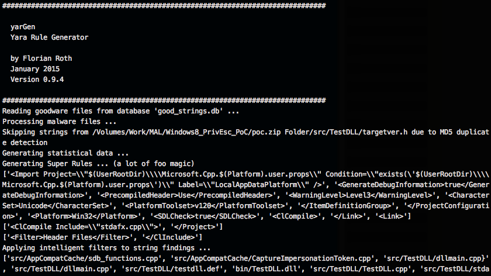
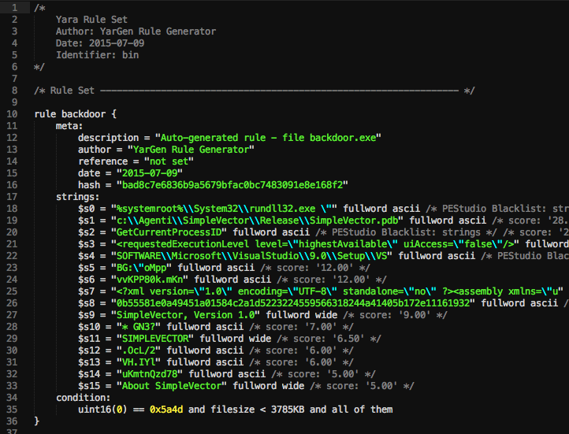

[](https://gist.github.com/cheerfulstoic/d107229326a01ff0f333a1d3476e068d)

# yarGen
                       _____
        __ _____ _____/ ___/__ ___
       / // / _ `/ __/ (_ / -_) _ \
       \_, /\_,_/_/  \___/\__/_//_/
      /___/  Yara Rule Generator
             Florian Roth, July 2020, Version 0.23.2
    
      Note: Rules have to be post-processed
      See this post for details: https://medium.com/@cyb3rops/121d29322282

### What does yarGen do?

yarGen is a generator for [YARA](https://github.com/plusvic/yara/) rules

The main principle is the creation of yara rules from strings found in malware files while removing all strings that also appear in goodware files. Therefore yarGen includes a big goodware strings and opcode database as ZIP archives that have to be extracted before the first use.

In version 0.24.0, yarGen introduces an output option (`--ai`). This feature generates a YARA rule with an expanded set of strings and includes instructions tailored for an AI. I suggest employing ChatGPT Plus with model 4 to refine these rules. Activating the `--ai` flag appends the instruction text to the `yargen_rules.yar` output file, which can subsequently be fed into your AI for processing.

With version 0.23.0 yarGen has been ported to Python3. If you'd like to use a version using Python 2, try a previous release. (Note that the download location for the pre-built databases has changed, since the database format has been changed from the outdated `pickle` to `json`. The old databases are still available but in an old location on our web server only used in the old yarGen version <0.23) 

Since version 0.12.0 yarGen does not completely remove the goodware strings from the analysis process but includes them with a very low score depending on the number of occurrences in goodware samples. The rules will be included if no
better strings can be found and marked with a comment /* Goodware rule */.
Force yarGen to remove all goodware strings with --excludegood. Also since version 0.12.0 yarGen allows to place the "strings.xml" from [PEstudio](https://winitor.com/) in the program directory in order to apply the blacklist definition during the string analysis process. You'll get better results.

Since version 0.14.0 it uses naive-bayes-classifier by Mustafa Atik and Nejdet Yucesoy in order to classify the string and detect useful words instead of compression/encryption garbage.

Since version 0.15.0 yarGen supports opcode elements extracted from the `.text` sections of PE files. During database creation it splits the `.text` sections with the regex [\x00]{3,} and takes the first 16 bytes of each part
to build an opcode database from goodware PE files. During rule creation on sample files it compares the goodware opcodes with the opcodes extracted from the malware samples and removes all opcodes that also appear in the goodware
database. (there is no further magic in it yet - no XOR loop detection etc.) The option to activate opcode integration is '--opcodes'.

Since version 0.17.0 yarGen allows creating multiple databases for opcodes and strings. You can now easily create a new database by using "-c" and an identifier "-i identifier" e.g. "office". It will then create two new
database files named "good-strings-office.db" and "good-opcodes-office.db" that will be initialized during startup with the built-in databases.

Since version 0.18.0 yarGen supports extra conditions that make use of the `pe` module. This includes [imphash](https://www.fireeye.com/blog/threat-research/2014/01/tracking-malware-import-hashing.html) values and the PE file's exports. We provide pre-generated imphash and export databases.

Since version 0.19.0 yarGen support a 'dropzone' mode in which it initializes all strings/opcodes/imphashes/exports only once and queries a given folder for new samples. If it finds new samples dropped to the folder, it creates rules for these samples, writes the YARA rules to the defined output file (default: yargen_rules.yar) and removes the dropped samples. You can specify a text file (`-b`) from which the identifier is read. The reference parameter (`-r`) has also been extended so that it can be a text file on disk from which the reference is read. E.g. drop two files named 'identifier.txt' and 'reference.txt' together with the samples to the folder and use the parameters `-b ./dropzone/identifier.txt` and `-r ./dropzone/reference.txt` to read the respective strings from the files each time an analysis starts.

Since version 0.20.0 yarGen supports the extraction and use of hex encoded strings that often appear in weaponized RTF files.

The rule generation process also tries to identify similarities between the files that get analyzed and then combines the strings to so called **super rules**. The super rule generation does not remove the simple rule for the files that have been combined in a single super rule. This means that there is some redundancy when super rules are created. You can suppress a simple rule for a file that was already covered by super rule by using --nosimple.

### Installation

1. Make sure you have at least 4GB of RAM on the machine you plan to use yarGen (8GB if opcodes are included in rule generation, use with --opcodes)
2. Install all dependencies with `pip install -r requirements.txt` (or `pip3 install -r requirements.txt`)
3. Run `python yarGen.py --update` to automatically download the built-in databases. The are saved into the  './dbs' sub folder. (Download: 913 MB)
4. See help with `python yarGen.py --help` for more information on the command line parameters

### Memory Requirements

Warning: yarGen pulls the whole `goodstring` database to memory and uses at least 3 GB of memory for a few seconds - 6 GB if opcodes evaluation is activated (--opcodes).

I've already tried to migrate the database to sqlite but the numerous string comparisons and lookups made the analysis painfully slow.

# Post-Processing Video Tutorial

[](https://medium.com/@cyb3rops/how-to-post-process-yara-rules-generated-by-yargen-121d29322282)

# Multiple Database Support

yarGen allows creating multiple databases for opcodes or strings. You can easily create a new database by using "-c" for new database creation and "-i identifier" to give the new database a unique identifier as e.g. "office". It will the create two new database files named "good-strings-office.db" and "good-opcodes-office.db" that will from then on be initialized during startup with the built-in databases.

### Database Creation / Update Example

Create a new strings and opcodes database from an Office 2013 program directory:
```
yarGen.py -c --opcodes -i office -g /opt/packs/office2013
```
The analysis and string extraction process will create the following new databases in the "./dbs" sub folder.
```
good-strings-office.db
good-opcodes-office.db
```
The values from these new databases will be automatically applied during the rule creation process because all *.db files in the sub folder "./dbs" will be initialized during startup.

You can update the once created databases with the "-u" parameter
```
yarGen.py -u --opcodes -i office -g /opt/packs/office365
```
This would update the "office" databases with new strings extracted from files in the given directory.

## Command Line Parameters

```
usage: yarGen.py [-h] [-m M] [-y min-size] [-z min-score] [-x high-scoring]
                 [-w superrule-overlap] [-s max-size] [-rc maxstrings]
                 [--excludegood] [-o output_rule_file] [-e output_dir_strings]
                 [-a author] [-r ref] [-l lic] [-p prefix] [-b identifier]
                 [--score] [--strings] [--nosimple] [--nomagic] [--nofilesize]
                 [-fm FM] [--globalrule] [--nosuper] [--update] [-g G] [-u]
                 [-c] [-i I] [--dropzone] [--nr] [--oe] [-fs size-in-MB]
                 [--noextras] [--debug] [--trace] [--opcodes] [-n opcode-num]

yarGen

optional arguments:
  -h, --help            show this help message and exit

Rule Creation:
  -m M                  Path to scan for malware
  -y min-size           Minimum string length to consider (default=8)
  -z min-score          Minimum score to consider (default=0)
  -x high-scoring       Score required to set string as 'highly specific
                        string' (default: 30)
  -w superrule-overlap  Minimum number of strings that overlap to create a
                        super rule (default: 5)
  -s max-size           Maximum length to consider (default=128)
  -rc maxstrings        Maximum number of strings per rule (default=20,
                        intelligent filtering will be applied)
  --excludegood         Force the exclude all goodware strings

Rule Output:
  -o output_rule_file   Output rule file
  -e output_dir_strings
                        Output directory for string exports
  -a author             Author Name
  -r ref                Reference (can be string or text file)
  -l lic                License
  -p prefix             Prefix for the rule description
  -b identifier         Text file from which the identifier is read (default:
                        last folder name in the full path, e.g. "myRAT" if -m
                        points to /mnt/mal/myRAT)
  --score               Show the string scores as comments in the rules
  --strings             Show the string scores as comments in the rules
  --nosimple            Skip simple rule creation for files included in super
                        rules
  --nomagic             Don't include the magic header condition statement
  --nofilesize          Don't include the filesize condition statement
  -fm FM                Multiplier for the maximum 'filesize' condition value
                        (default: 3)
  --globalrule          Create global rules (improved rule set speed)
  --nosuper             Don't try to create super rules that match against
                        various files

Database Operations:
  --update              Update the local strings and opcodes dbs from the
                        online repository
  -g G                  Path to scan for goodware (dont use the database
                        shipped with yaraGen)
  -u                    Update local standard goodware database with a new
                        analysis result (used with -g)
  -c                    Create new local goodware database (use with -g and
                        optionally -i "identifier")
  -i I                  Specify an identifier for the newly created databases
                        (good-strings-identifier.db, good-opcodes-
                        identifier.db)

General Options:
  --dropzone            Dropzone mode - monitors a directory [-m] for new
                        samples to processWARNING: Processed files will be
                        deleted!
  --nr                  Do not recursively scan directories
  --oe                  Only scan executable extensions EXE, DLL, ASP, JSP,
                        PHP, BIN, INFECTED
  -fs size-in-MB        Max file size in MB to analyze (default=10)
  --noextras            Don't use extras like Imphash or PE header specifics
  --debug               Debug output
  --trace               Trace output

Other Features:
  --opcodes             Do use the OpCode feature (use this if not enough high
                        scoring strings can be found)
  -n opcode-num         Number of opcodes to add if not enough high scoring
                        string could be found (default=3)
```

## Best Practice

See the following blog posts for a more detailed description on how to use yarGen for YARA rule creation: 

[How to Write Simple but Sound Yara Rules - Part 1](https://www.bsk-consulting.de/2015/02/16/write-simple-sound-yara-rules/)

[How to Write Simple but Sound Yara Rules - Part 2](https://www.bsk-consulting.de/2015/10/17/how-to-write-simple-but-sound-yara-rules-part-2/)

[How to Write Simple but Sound Yara Rules - Part 3](https://www.bsk-consulting.de/2016/04/15/how-to-write-simple-but-sound-yara-rules-part-3/)
  
## Screenshots





As you can see in the screenshot above you'll get a rule that contains strings, which are not found in the goodware strings database. 

You should clean up the rules afterwards. In the example above, remove the strings $s14, $s17, $s19, $s20 that look like random code to get a cleaner rule that is more likely to match on other samples of the same family.

To get a more generic rule, remove string $s5, which is very specific for this compiled executable.
 
## Examples

### Dropzone Mode (Recommended)

Monitors a given folder (-m) for new samples, processes the samples, writes YARA rules to the set output file (default: yargen_rules.yar) and deletes the folder contents afterwards.

```python yarGen.py -a "yarGen Dropzone" --dropzone -m /opt/mal/dropzone```

WARNING: All files dropped to the set dropzone will be removed!

In the following example two files named `identifier.txt` and `reference.txt` are read and used for the `reference` and as identifier in the YARA rule sets. The files are read at each iteration and not only during initialization. This way you can pass specific strings to each dropzone rule generation.

```python yarGen.py --dropzone -m /opt/mal/dropzone -b /opt/mal/dropzone/identifier.txt -r /opt/mal/dropzone/reference.txt```

### Use the shipped database (FAST) to create some rules

```python yarGen.py -m X:\MAL\Case1401```

Use the shipped database of goodware strings and scan the malware directory 
"X:\MAL" recursively. Create rules for all files included in this directory and 
below. A file named 'yargen_rules.yar' will be generated in the current 
directory. 

### Show the score of the strings as comment

yarGen will by default use the top 20 strings based on their score. To see how a
certain string in the rule scored, use the "--score" parameter.

```python yarGen.py --score -m X:\MAL\Case1401```

### Use only strings with a certain minimum score

In order to use only strings for your rules that match a certain minimum score use the "-z" parameter. It is a good pratice to first create rules with "--score" and than perform a second run with a minimum score set for you sample set via "-z".  

```python yarGen.py --score -z 5 -m X:\MAL\Case1401```

### Preset author and reference

```python yarGen.py -a "Florian Roth" -r "http://goo.gl/c2qgFx" -m /opt/mal/case_441 -o case441.yar```

### Add opcodes to the rules

```python yarGen.py --opcodes -a "Florian Roth" -r "http://goo.gl/c2qgFx" -m /opt/mal/case33 -o rules33.yar```

### Show debugging output

```python yarGen.py --debug -m /opt/mal/case_441```

### Create a new goodware strings database

```python yarGen.py -c --opcodes -g /home/user/Downloads/office2013 -i office```

This will generate two new databases for strings and opcodes named:
- good-strings-office.db
- good-opcodes-office.db

The new databases will automatically be initialized during startup and are from then on used for rule generation.

### Update a goodware strings database (append new strings, opcodes, imphashes, exports to the old ones)

```python yarGen.py -u -g /home/user/Downloads/office365 -i office```

### My Best Pratice Command Line

```python yarGen.py -a "Florian Roth" -r "Internal Research" -m /opt/mal/apt_case_32```

# db-lookup.py

A tool named `db-lookup.py`, which was introduced with version 0.18.0 allows you to query the local databases in a simple command line interface. The interface takes an input value, which can be `string`, `export` or `imphash` value, detects the query type and then performs a lookup in the loaded databases. This allows you to query the yarGen databases with `string`, `export` and `imphash` values in order to check if this value appears in goodware that has been processed to generate the databases.

This is a nice feature that helps you ta answer the following questions:

* Does this string appear in goodware samples of my database?
* Does this export name appear in goodware samples of my database?
* Does a sample in my goodware database has this imphash?

However, there are several drawbacks:

* It does only match on the full string (no contains, no startswith, no endswith)
* Opcode lookup is not supported (yet)

I plan to release a new project named `Valknut` which extracts overlapping byte sequences from samples and creates searchable databases. This project will be the new backend API for yarGen allowing all kinds of queries, opcodes and string values, ascii and wide formatted.
